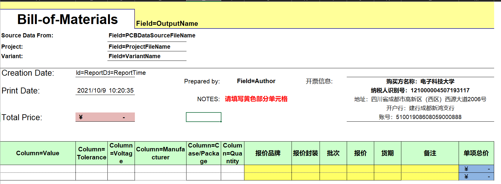

# 采购说明

该文档包含采购的注意事项

## 当前版本信息

## V1

*by ayaya, 2021-10-09*

initial all

# 框架使用说明

## 文件夹说明

该目录下, 每一个文件夹对应一个版本的采购表格, 当工程文件已经投厂, 并决定开始采购时, **必须**将对应版本的采购文件复制进 nas 中对应工程文件夹下. 

该文件夹下必须要有一份采购表格源文件, 并添加后缀 original. 后续与供应商交流时使用复制的文档.

## 采购表格格式说明

采购表格模板如下图

表格中已经包含部分计算公式, 白色部分在 AD 系统生成 BOM 时会自动填充, 报价商应填写黄色部分

表格从左到右的系统参数解释如下:

1. Value, 包含器件型号或是阻值, 容值等
2. Tolerance, 仅无源器件使用, 表示精度误差范围
3. Voltage, 仅电容使用, 表示耐压值
4. Manufacturer, 表明生厂商, 部分通用器件可能没有
5. Package, 表明封装
6. Quantity, 系统默认输出为单板数量, 采购时该项需要替换为目标购买数量

黄色部分为商家填写部分. 

**报价**为必须, 其他可不用.

## 采购数量说明

### 名词解释

打样数量: 本次投厂打样的总数量, 如 5pcs, 10pcs 等

焊接数量: 预计焊接的数量, 如 2pcs, 4pcs 等

### 芯片采购

芯片采购分为订货和现货两种

正常情况下, 计算公式为:

* 关于无源器件(常规电阻, 常规电容, 常规电感), 计算公式为: 

> 1. 少量
>    * 购买数量=打样数量*单板需求数量, 并向上10取整. 
>      如本次打样了 5pcs, 单板需求 1pcs, 则采购 10pcs. 
> 2. 大量
>    * 若 打样数量*单板需求数量 > 100pcs, 购买盘料
> 3. 特殊无源器件(高频电阻, 高频电容等)
>    * 按 IC 类别购买

* 关于有源器件(IC, 二极管等), 计算公式为:

> 1. 现货
>    * 购买数量 = 焊接数量 + 2
> 2. 订货
>    * 购买数量 = 焊接数量 * 2
> 3. 囤货
>    * 部分 IC 使用量大, 可一次性大量购买. 这类 IC 购买方式需根据具体情况商议

# 购买注意事项⚠

1. 不同供货商有不同擅长领域, 购买时需要多方对比

# 历史版本信息

