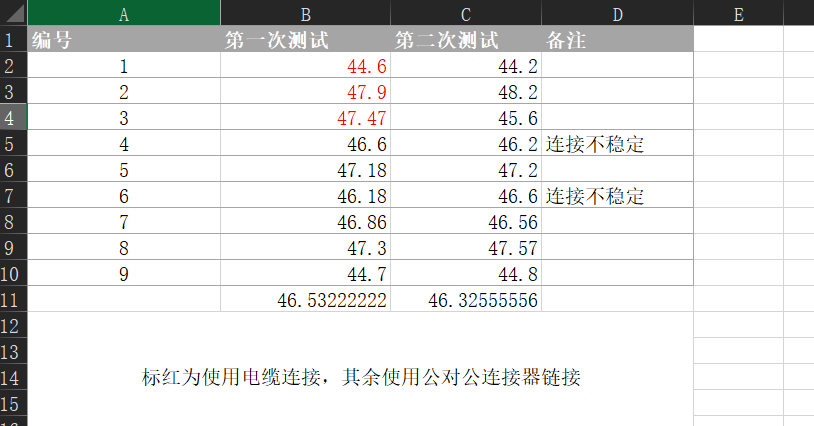
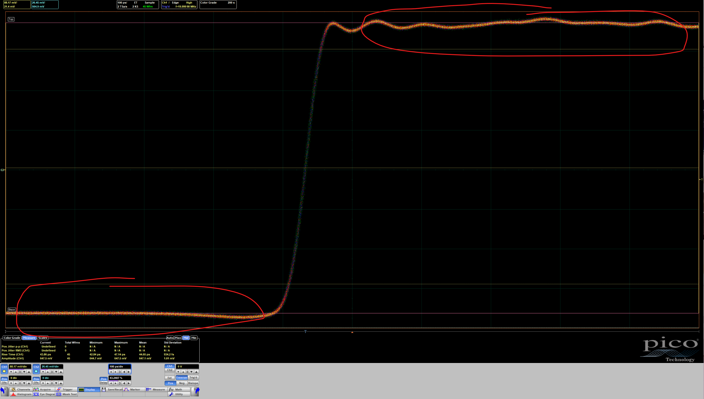
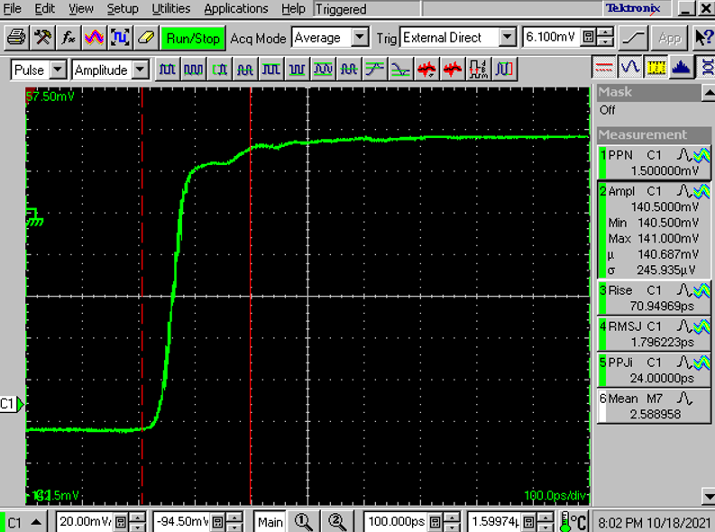
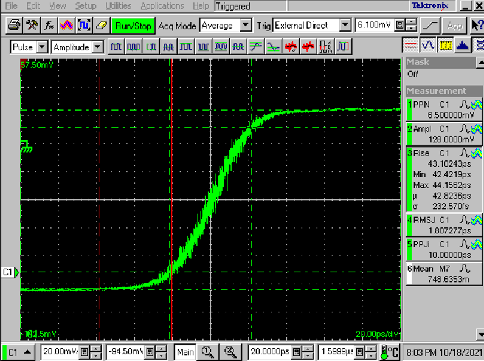
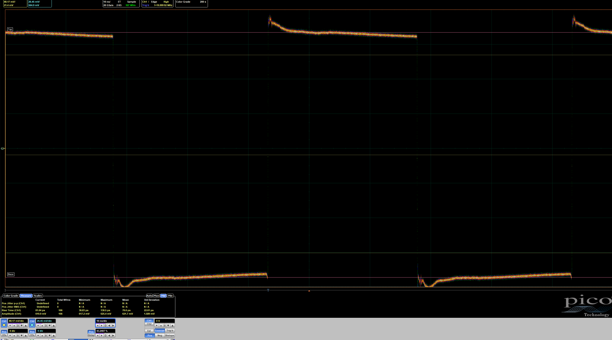

# 测试记录

该文档包含对测试数据保存和提交格式的说明, 也会附加一些常见测试的测试流程, 并包含需要注意的事项

## 当前版本信息

### V1-3

*by ayaya, 2021-10-18*

完善了脉冲源测试的说明

## 测试数据格式说明

### 名词解释

*   测试编号: 对本次测试的编号, 包含硬件版本信息, 软件版本信息(optional), 测试版本信息
*   编号文件夹: 以测试编号为名称的文件夹, 包含该次测试的测试数据

### 文件夹格式说明

*   **该测试架构采用基于硬件版本的测试数据管理**, 即, 不同的硬件版本有不同的测试编号, 相互独立. 该编号也是测试文件存放文件夹的名字. 例如, 硬件版本号为 V1 的第一次测试, 名字就是 V1T1, 第二次就是 V1T2, 以此类推.

*   **对于需要驱动的硬件系统, 编号中需要额外加上驱动的版本号**, 如 V1C1T1
*   **硬件版本区分到小版本, 但不区分驱动版本**, 如若存在 V1-1, V1-2 两个硬件版本, 需将两个版本的测试隔开, 即可能会出现 V1-1T1, V1-2T1 两个测试项, 但不同驱动版本统一管理, 如第一次测试 V1 时驱动版本为 C1, 则编号为 V1C1T1, 如果第二次测试时驱动版本为 C2, 则编号为 V1C2T2.
*   **如果对同一硬件版本的多张板子进行测试, 则采用同一个编号, 并在文件夹下新建子文件夹**. 如测试板编号分别为 2、3、4、5, 同时测试时, 无需使用 V1T2, V1T3, V1T4, V1T5 四个编号, 仅需采用一个 V1T2, 并在该文件夹下新建 2, 3, 4, 5 四个文件夹, 将不同编号的测试数据放在不同子文件夹.
*   **阻抗测试线的阻抗测试较为特殊, 需要在测试编号前额外添加一个 Z**, 如第一次测试硬件版本 V1 的阻抗测试线, 编号为 ZV1T1.

### 文件格式说明

*   **对同一编号下的测试必须包含测试配置图**, 该图需要包含测试仪器, 测试配置的信息
*   **对同一编号下的==子测试==必须包含实物图**, 该图需要包含测试对象的编号
*   **每次测试需要存储关键数据的高清图**, 除配置图和实物图外, 尽量使用系统内建截图工具, 保留原始波形图片, 必要时还需保留波形原始数据.

### Commit 格式说明

*   提交格式为 Test [测试版本号], 如硬件版本 V1 的第一次测试, 提交名称即为 Test V1T1

### 文档说明

*   文档中对每个编号需要新建一个 title2 进行测试内容说明, 本文档中已给出 V1T1 的模版
*   文档中**需要**附加测试人以及测试时间
*   文档中**需要**说明使用到的关键仪器
*   文档中**需要**说明具体文件名称的意义
*   文档中可以说明测试人对本次测试结果的看法

### 额外说明

*   同一次测试, 同一个硬件版本, 只会产生一个编号文件夹
*   部分测试的要求见**部分测试项目说明**
*   将文档中的图片存于 .img 中, 详情见工程框架说明.

## 测试注意事项⚠️

1. 测试实时波形的数据, 截图中必须包含水平分度和垂直分度的信息
2. 使用多通道仪器进行测试时, 必须选中关键数据所在的通道, 即显示关键数据通道的垂直分度和水平分度信息

## T1

*by ayaya, 2021-09-26, 测试人需修改该行*

### 使用的关键仪器

### 测试文件说明

### 测试结果说明 

## 部分测试项目说明

### 阻抗测试

#### 使用 80E04 模块测试

**该模块无 ESD 保护, 禁止直接触摸中心导体**

若使用校准算法测试, 流程如下: 

>   1.   确保 8200 仪器工作正常, 温度补偿正确
>   2.   接上线缆(optional), 接上转接头(optional), 打开 TDR, 合理设置边沿类型(根据校准时的方向而定), 将数据类型设置为电压V
>   3.   寻找参考平面(开路点), 并将参考平面调节至显示中的从左往右第一格, 接上 DUT, 调节水平分度, 使显示区域能覆盖整个 DUT 阻抗段
>   4.   **调节垂直分度至 2ohm/div**, 将目标待测阻抗居中(如 50ohm), 并选中校准后通道(使垂直分度和水平分度显示正确)
>   5.   取下 DUT, 将校准后的阻抗测试通道(Math的某一通道)存储在 Reference 中
>   6.   接上 DUT, 添加 Measure -> Mean, 并将作用范围调节为 DUT 阻抗中段
>   7.   保留测试图像

若使用内建阻抗计算, 流程如下:

>   1.   确保 8200 仪器工作正常, 温度补偿正确
>   2.   接上线缆(optional), 接上转接头(optional), 打开 TDR, 合理设置边沿类型, 将数据类型改为阻抗Ω
>   3.   寻找参考平面(开路点), 并将参考平面调节至显示中的从左往右第一格, 接上 DUT, 调节水平分度, 使显示区域能覆盖整个 DUT 阻抗段
>   4.   **调节垂直分度至 2ohm/div**, 将目标待测阻抗居中(如 50ohm), 并选中校准后通道(使垂直分度和水平分度显示正确)
>   5.   取下 DUT, 测试通道数据存储在 Reference 中
>   6.   接上 DUT, 添加 Measure -> Mean, 并将作用范围调节为 DUT 阻抗中段
>   7.   保留测试图像

校准算法测试对于会影响偏置的 DUT 的阻抗测量不准, 这时必须使用内建阻抗计算.

#### 文件夹格式说明

文件夹名称需要加一个 "Z"(见 [文件夹格式说明](#文件夹格式说明))

文件夹下需要为每一个 DUT 创建一个子文件夹, 子文件夹名称与编号一致, 子文件夹内容见 [文件格式说明](#文件格式说明)

文件夹下需要创建一个 excel 表格, 表格内容为对应编号的阻抗, 同时附加备注信息, 最后附上平均值, 如下图

### 抖动测试

#### 使用 80E04 模块测试

使用 8200 输出脉冲触发 DUT

>   1.   确保 8200 仪器工作正常, 温度补偿正确, 并且 TDR 未打开
>   2.   设置触发模式为 Internal, 接上 DUT, 寻找待测边沿, 并调节水平分度为 20ps/div, 将待测边沿至于显示中央
>   3.   调节垂直分度使波形下段与上端间相差约 40ps
>   4.   进入 Aquire, 将 Waveform Database 修改为 finite, 设置为 250(1000000 samples)
>   5.   添加 Measure -> Time(?) -> RMS Jitter, Measure -> Time(?) -> Pk-Pk Jitter, 使用 waveform database, 并调节两个测量项作用范围为 0-100%
>   6.   等待 2min, 分别记录 RMS Jitter 和 Pk-Pk Jitter 的统计数据

### 脉冲源测试

脉冲源测试需要记录的数据:

#### 上升沿时间、下降沿时间

上升沿时间(Tr)/下降沿时间(Tf), 取决于关注边沿

1. 配置测试环境
2. 测量上升沿时间需要将时基调整到能见到信号的两段平滑段, 如下图. 

3. 开启 Average 功能, Average 16
4. 等待一段时间后记录数据.

正常情况下, 水平分度设置与上升沿时间接近即可, 如 35ps Tr 信号, 水平设置 50ps/div; 80ps Tr 信号, 设置水平为 100ps/div. 但具体值需根据状况调整

##### 注意⚠

若上升沿波形存在变形(见下图), 对于:

1. **脉冲波形存在阶梯**的情况, 测量上升沿时需要测试两份数据, 一份是高速沿部分, 一份是整段部分. 整段部分按常规测试要求. 高速沿部分需使测量值仅仅包含高速脉冲部分, 如下图

#### 抖动

1. 抖动(RMS/pk-pk)

   1. 抖动测试方法见[抖动测试](#抖动测试)

#### 整段周期波形

1. 整段周期波形

   1. 如周期 50ns 信号(20MHz), 设置水平分度为 10ns/div, 如下图

   

   正常来说示波器的显示, 水平部分包含 10div, 若周期 50ns, 则需设置水平能见范围 > 50ns, 最好取两倍, 即 100ns, 100ns/10 = 10ns/div. 但也不必完全精准, 以调试情况为准

#### 注意⚠

测试抖动时必须保留足够多的波形, 同时必须限制波形的数量, 不能太多

保留的数据以 50-100Wfm 为佳

## 历史版本信息

### V1

*by ayaya, 2021-09-26*

**Initial all**

### V1-1

*by ayaya, 2021-10-09*

添加了脉冲源测试的说明

添加了部分测试基本规则

### V1-2

*by ayaya, 2021-10-09*

完善了阻抗测试的说明, 以及阻抗测试文件夹格式的说明

添加了一项测试注意事项
